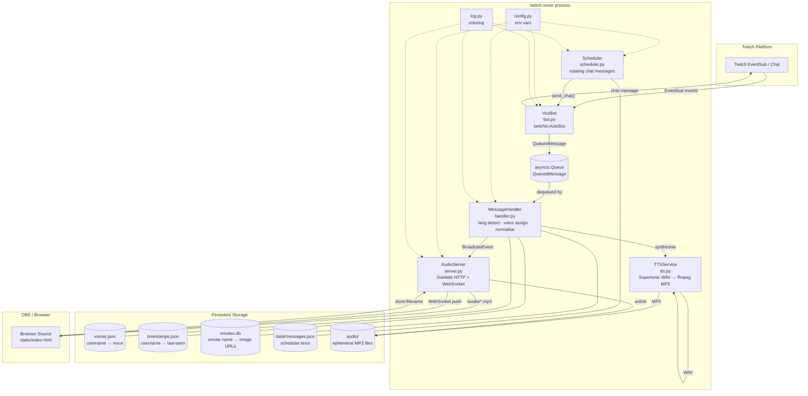
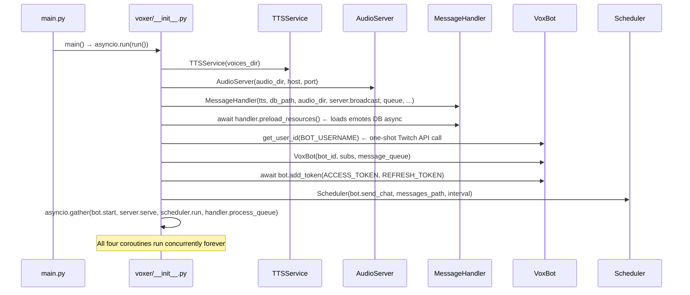
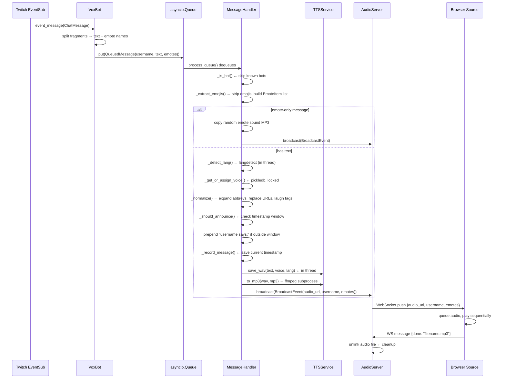
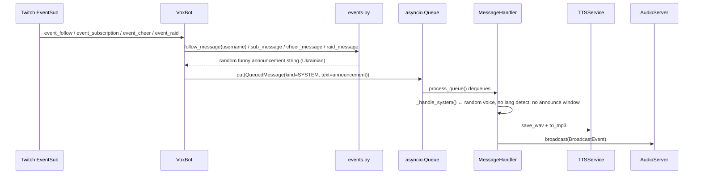
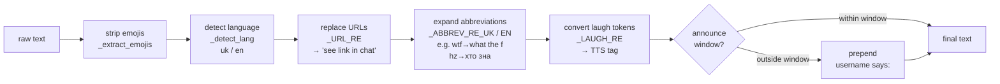
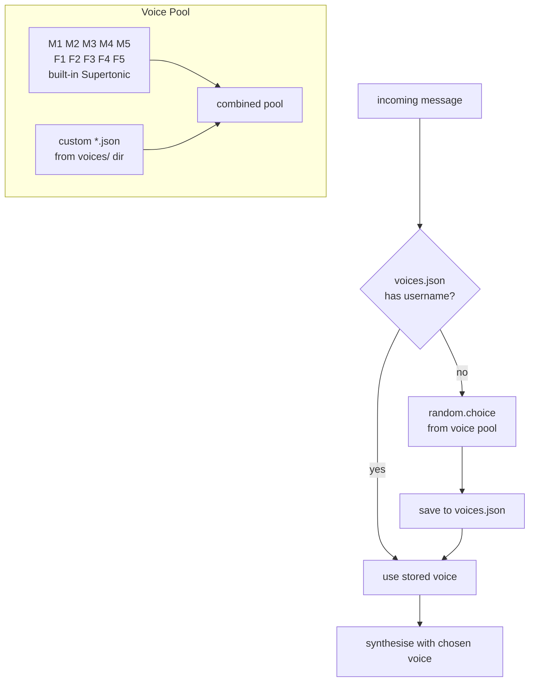
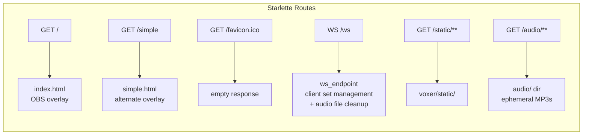
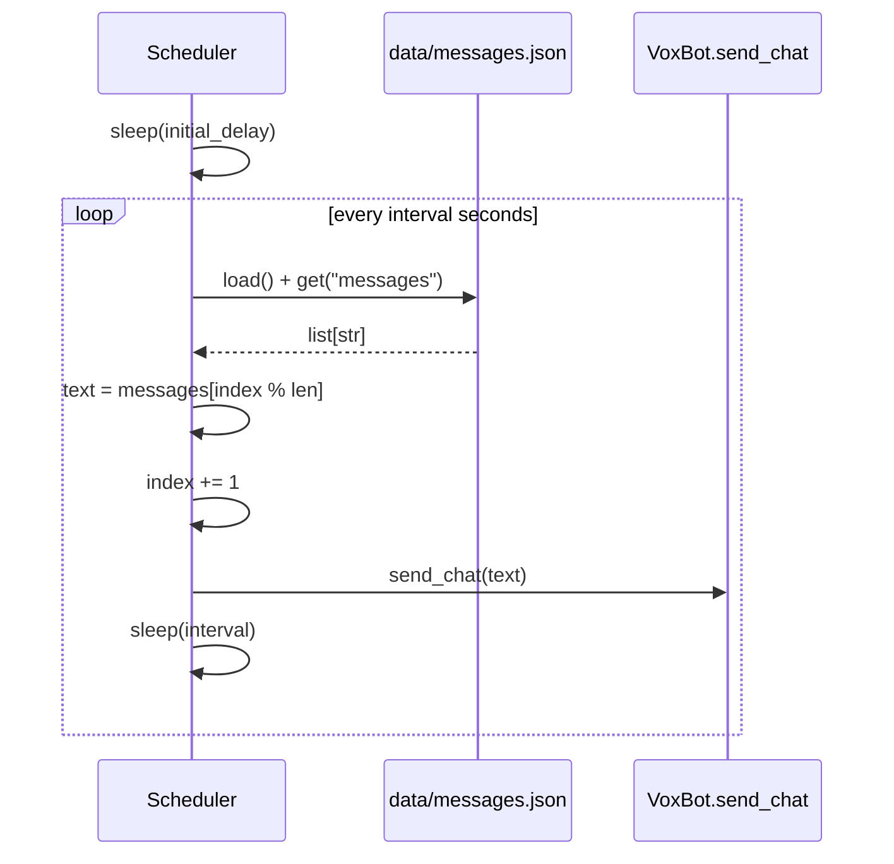

# twitch-voxer — Architecture

## Overview

`twitch-voxer` is a self-hosted Twitch chat Text-to-Speech bot.  
It listens to EventSub events from Twitch, synthesises speech for every incoming chat message, and streams the resulting audio to an OBS browser-source overlay via WebSocket.

---

## High-Level Component Map

---

## Startup / Wiring Sequence

`voxer/__init__.py` is the **composition root** — it instantiates every component and wires their dependencies before handing control to `asyncio.gather`.

---

## Message Lifecycle — Chat Message → Audio

---

## Channel Events (Follow / Sub / Raid / Cheer)

Channel events bypass the full user pipeline and go straight to TTS with a random voice in Ukrainian.

---

## Text Normalisation Pipeline (handler.py)

Applied to every user message before synthesis.

---

## Voice Assignment

Each chatter gets a voice on first message and keeps it forever.

---

## AudioServer — HTTP + WebSocket Endpoints

---

## Scheduler

Posts rotating messages to Twitch chat on a fixed interval.  
The DB is re-read every cycle so messages can be updated without a restart.

---

## Key Design Decisions

| Decision | Rationale |
|---|---|
| `asyncio.Queue` between bot and handler | Decouples Twitch event arrival from potentially slow TTS synthesis; prevents event backpressure in the bot. |
| `asyncio.to_thread` for lang detect + WAV synthesis | Both `langdetect` and Supertonic are synchronous CPU-bound calls; offloading them keeps the event loop responsive. |
| `asyncio.Lock` around `_db` and `_ts_db` | pickledb is not async-safe; the lock prevents concurrent load/save races on the same file. |
| Separate `preload_resources()` method on `MessageHandler` | `async def __init__` is not valid Python; `preload_resources()` handles the async emotes-DB load that must happen before messages are processed. |
| Audio file deleted by the browser client | The server cannot know when the browser finishes playing; the client sends a `{done: filename}` WS message after the `<audio>` element fires `ended`, then the server unlinks the file. |
| Path traversal check before unlink | `path.parent == self._audio_dir.resolve()` prevents a malicious WS message from deleting arbitrary files on the server. |
| data/messages.json reloaded every scheduler cycle | Allows live edits without restarting the bot; the DB read is cheap. |
| Longest abbreviation first in regex alternation | Without longest-first ordering, shorter prefixes (`gg`) would match before longer keys (`ggwp`), producing wrong expansions. |
