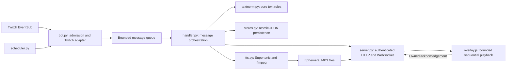

# Architecture

`twitch-voxer` is a single-process, single-channel service. Python 3.14 runs
TwitchIO EventSub, the Starlette/Uvicorn server, a bounded message queue and the
scheduler in one asyncio event loop. Supertonic inference runs in a serialized
worker thread; ffmpeg runs as a bounded subprocess. The OBS client is plain
JavaScript, with shared playback logic and two visual presentations.

```mermaid
flowchart LR
    Twitch[Twitch EventSub] --> Bot[bot.py: admission and Twitch adapter]
    Bot --> Queue[Bounded message queue]
    Queue --> Handler[handler.py: message orchestration]
    Handler --> Text[textnorm.py: pure text rules]
    Handler --> Stores[stores.py: atomic JSON persistence]
    Handler --> TTS[tts.py: Supertonic and ffmpeg]
    TTS --> Audio[Ephemeral MP3 files]
    Handler --> Server[server.py: authenticated HTTP and WebSocket]
    Audio --> Server
    Server --> OBS[overlay.js: bounded sequential playback]
    OBS -->|Owned acknowledgement| Server
    Scheduler[scheduler.py] --> Bot
```

## Responsibilities

| Module | Owns |
| --- | --- |
| `app.py` | Composition, startup ordering, TaskGroup lifecycle, final store checkpoints |
| `config.py` | Environment parsing, credential and network policy validation |
| `models.py` | Message/event values, monotonic enqueue time, safe audio filenames |
| `bot.py` | Twitch identity, subscriptions, admission, deduplication, avatars |
| `oauth.py` | Fixed redirect/scopes, browser-bound state, grant validation |
| `token_store.py` | Private atomic credentials and exclusive refresh ownership |
| `handler.py` | Text/emote preparation, voice choice, synthesis and publication |
| `textnorm.py`, `events.py` | Pure normalization and announcement rules |
| `tts.py` | Serialized model access, bounded conversion and cancellation cleanup |
| `stores.py` | Bounded voice/emote/timestamp state and durable JSON writes |
| `server.py` | Access policy, recipient receipts, audio ownership and expiry |
| `scheduler.py` | Validated weighted messages, finite cadence, send deadlines |
| `log.py` | Logging and credential redaction, including exceptions |
| `fetch_emotes.py` | Separate bounded Twitch metadata refresh command |
| `static/overlay.js` | Shared connection, queue, playback watchdog and teardown |
| `static/index.html`, `static/simple.html`, `static/overlay.css` | Overlay markup, styles and shared accessibility |
| `static/full.js`, `static/simple.js` | Full and lightweight visual adapters, motion preferences and effect cleanup |
| `static/vendor/` | Pinned graphics libraries, licenses and provenance |

Keep dependencies explicit: the handler receives broadcast and overlay-status
callbacks; the scheduler receives a chat-send callback. Neither constructs its
network adapter. Stores own persistence; text rules perform no I/O. Add an
abstraction when multiple real implementations need it, rather than wrapping
every function in an interface.

## Lifecycle and resource ownership

Startup validates settings, prepares directories, removes old generated audio,
loads the model and stores, and resolves the Twitch account. The bot, server,
consumer and reaper run together. The scheduler starts after authorization and
subscription setup. A fatal component error cancels sibling tasks.

Admission happens before expensive work. Duplicate, oversized, excessive and
overflow chat is dropped. System events also use bounded admission instead of
accumulating waiting producers. The consumer discards stale messages and skips
synthesis when no overlay is attached. Text expansion, emotes, conversion time
and subprocess output have independent bounds.

Each clip has a set of recipient overlays. Only those recipients can acknowledge
it; the first acknowledgement cannot delete another overlay's queued audio.
Disconnects, capacity limits and expiry release receipts. A periodic age-based
reaper supplies a final disk-retention bound. Browser reconnects discard receipts
from the old connection, and the browser queue has its own capacity and age limits.
Returning from the browser's back-forward cache creates a fresh connection.
Decorative render loops stop when hidden or when reduced motion is requested.

Shutdown closes clients, kills/reaps ffmpeg, cleans generated files and flushes
voice/timestamp state. A native inference call cannot be forcibly stopped in a
Python thread; its eventual output is cleaned after cancellation. Hard inference
deadlines require process isolation.

## Persistence and compatibility

Voice and timestamp files retain their existing JSON schemas. Unique private
temporary files and atomic replacement prevent torn snapshots. Voice assignments
hold their write lock until an active disk writer finishes, including repeated
cancellation, so an old writer cannot overwrite a newer snapshot. Assignments
are saved when changed and retried after transient failures. Announcement
timestamps checkpoint at most once per 30 seconds during activity and flush at
shutdown. An abrupt crash can therefore repeat a username announcement, without
truncating the whole database. Caches have finite capacity and reject malformed
entries.

The bot owns token refresh while running. The downloader can reuse a valid grant,
but must obtain refresh ownership before rotating credentials. Stop the bot if a
refresh is needed. The downloader atomically publishes a complete emote snapshot,
removing deleted entries. The cache remains keyed by display name with deterministic
precedence; carrying Twitch emote IDs is a future schema migration.

## Trust boundaries and tests

Twitch text, emote metadata and browser frames are untrusted input. Twitch secrets
stay on the backend; overlays use a separate credential. Host and Origin checks
also protect local deployments. Executable browser assets are served locally.
See [SECURITY.md](SECURITY.md) for deployment and proxy settings.

Pytest exercises fake Twitch/TTS adapters, ASGI routes, protocol abuse, persistence
failures and cancellation. Node tests exercise playback and reconnect behavior.
The optional Chromium smoke test in `tests/browser_overlay.py` exercises actual
local WebSocket delivery, MP3 playback, rendering, keyboard recovery and reduced
motion. Real Twitch grants, native synthesis quality and OBS/GPU behavior still
require integration smoke tests with those systems.
