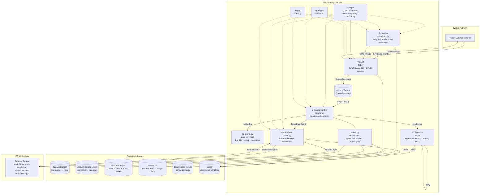
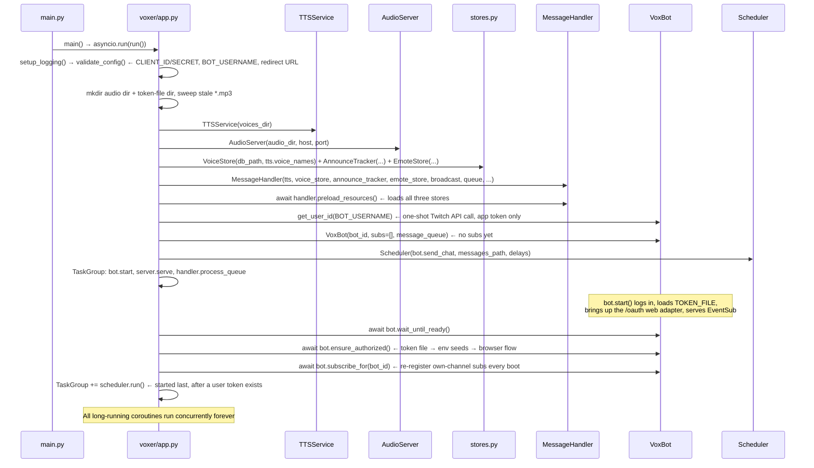
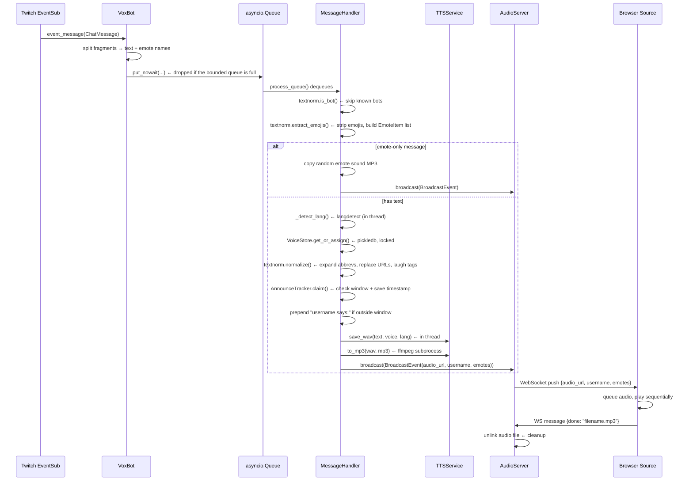
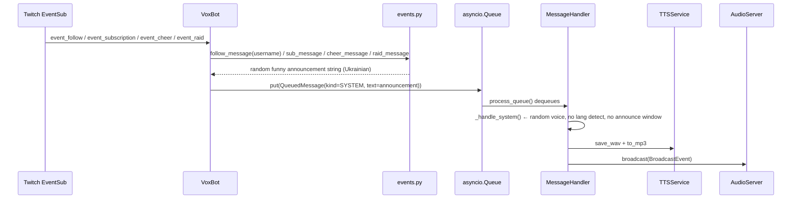
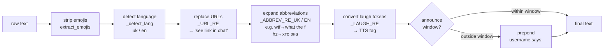
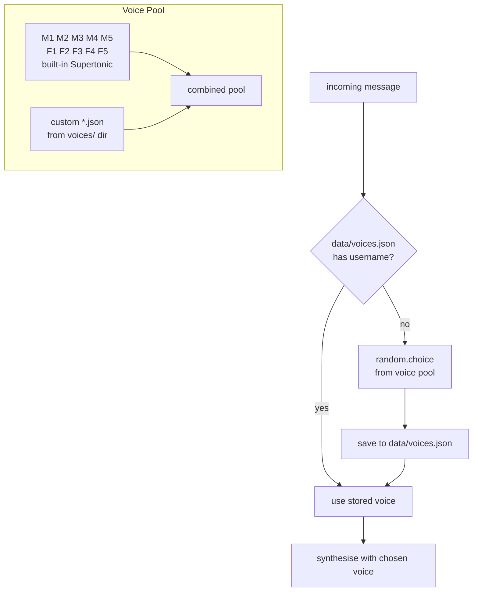
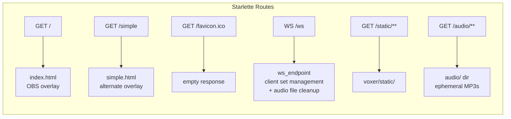
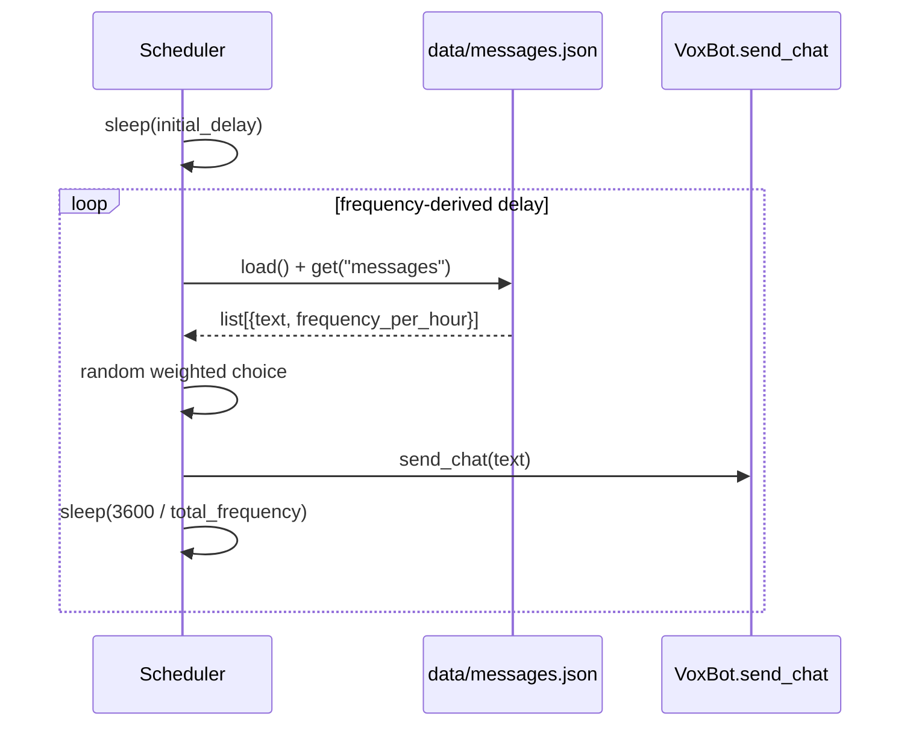

# twitch-voxer — Architecture

## Overview

`twitch-voxer` is a self-hosted Twitch chat Text-to-Speech bot.  
It listens to EventSub events from Twitch, synthesises speech for every incoming chat message, and streams the resulting audio to an OBS browser-source overlay via WebSocket.

---

## High-Level Component Map

```mermaid
graph TD
    subgraph Twitch Platform
        TW[Twitch EventSub / Chat]
    end

    subgraph twitch-voxer process
        APP[app.py<br/>composition root<br/>wires everything · TaskGroup]
        BOT[VoxBot<br/>bot.py<br/>twitchio AutoBot + OAuth adapter]
        MQ[(asyncio.Queue<br/>QueuedMessage)]
        MH[MessageHandler<br/>handler.py<br/>pipeline orchestration]
        TN[textnorm.py<br/>pure text rules<br/>bot filter · emoji · normalise]
        STO[stores.py<br/>VoiceStore · AnnounceTracker · EmoteStore]
        TTS[TTSService<br/>tts.py<br/>Supertonic WAV → ffmpeg MP3]
        SRV[AudioServer<br/>server.py<br/>Starlette HTTP + WebSocket]
        SCH[Scheduler<br/>scheduler.py<br/>weighted random chat messages]
        CFG[config.py<br/>env vars]
        LOG[log.py<br/>colorlog]
    end

    subgraph Persistent Storage
        VDB[(data/voices.json<br/>username → voice)]
        TDB[(data/timestamps.json<br/>username → last-seen)]
        TOK[(data/tokens.json<br/>OAuth access + refresh tokens)]
        EDB[(emotes.db<br/>emote name → image URLs)]
        MSGS[(data/messages.json<br/>scheduler texts)]
        AUDIO[(audio/<br/>ephemeral MP3 files)]
    end

    subgraph OBS / Browser
        OBS[Browser Source<br/>static/index.html · simple.html<br/>shared runtime: static/overlay.js]
    end

    TW -- EventSub events --> BOT
    BOT -- QueuedMessage --> MQ
    MQ -- dequeued by --> MH
    MH -- text rules --> TN
    MH -- synthesise --> TTS
    TTS -- WAV --> TTS
    TTS -- MP3 --> AUDIO
    MH -- BroadcastEvent --> SRV
    SRV -- /audio/*.mp3 --> OBS
    SRV -- WebSocket push --> OBS
    OBS -- done:filename --> SRV
    SRV -- unlink --> AUDIO
    SCH -- send_chat() --> BOT
    BOT -- chat message --> TW
    BOT --- TOK
    MH --- STO
    STO --- VDB
    STO --- TDB
    STO --- EDB
    SCH --- MSGS
    APP -.-> BOT
    APP -.-> MH
    APP -.-> SRV
    APP -.-> SCH
    CFG -.-> BOT
    CFG -.-> MH
    CFG -.-> SRV
    CFG -.-> SCH
    LOG -.-> BOT
    LOG -.-> MH
    LOG -.-> SRV
    LOG -.-> SCH
```

---

## Startup / Wiring Sequence

`voxer/app.py` is the **composition root** — it instantiates every component and wires their dependencies before handing control to an `asyncio.TaskGroup` (`voxer/__init__.py` is now only the package docstring and `__version__`, so importing lightweight modules such as `voxer.models` never pulls in twitchio or the TTS engine).

Only `TWITCH_CLIENT_ID` and `TWITCH_CLIENT_SECRET` are required; user tokens are resolved at runtime by `ensure_authorized()` — from the token file, from optional env seed tokens, or through the one-time browser OAuth flow served by twitchio's built-in web adapter on `VOXER_OAUTH_HOST:VOXER_OAUTH_PORT`.

```mermaid
sequenceDiagram
    participant main as main.py
    participant app as voxer/app.py
    participant tts as TTSService
    participant srv as AudioServer
    participant sto as stores.py
    participant hdl as MessageHandler
    participant bot as VoxBot
    participant sch as Scheduler

    main->>app: main() → asyncio.run(run())
    app->>app: setup_logging() → validate_config()  ← CLIENT_ID/SECRET, BOT_USERNAME, redirect URL
    app->>app: mkdir audio dir + token-file dir, sweep stale *.mp3
    app->>tts: TTSService(voices_dir)
    app->>srv: AudioServer(audio_dir, host, port)
    app->>sto: VoiceStore(db_path, tts.voice_names) + AnnounceTracker(...) + EmoteStore(...)
    app->>hdl: MessageHandler(tts, voice_store, announce_tracker, emote_store, broadcast, queue, ...)
    app->>hdl: await handler.preload_resources()  ← loads all three stores
    app->>bot: get_user_id(BOT_USERNAME)  ← one-shot Twitch API call, app token only
    app->>bot: VoxBot(bot_id, subs=[], message_queue)  ← no subs yet
    app->>sch: Scheduler(bot.send_chat, messages_path, delays)
    app->>app: TaskGroup: bot.start, server.serve, handler.process_queue
    Note over bot: bot.start() logs in, loads TOKEN_FILE,<br/>brings up the /oauth web adapter, serves EventSub
    app->>bot: await bot.wait_until_ready()
    app->>bot: await bot.ensure_authorized()  ← token file → env seeds → browser flow
    app->>bot: await bot.subscribe_for(bot_id)  ← re-register own-channel subs every boot
    app->>app: TaskGroup += scheduler.run()  ← started last, after a user token exists
    Note over app: All long-running coroutines run concurrently forever
```

The scheduler is deliberately started **after** `ensure_authorized()` — it posts to chat, which needs a user token, and starting it earlier would 401 on every attempt. `subscribe_for(bot_id)` runs on every boot because Conduit EventSub subscriptions expire after 72 hours of downtime; duplicates are tolerated.

---

## Message Lifecycle — Chat Message → Audio

```mermaid
sequenceDiagram
    participant TW as Twitch EventSub
    participant BOT as VoxBot
    participant MQ as asyncio.Queue
    participant MH as MessageHandler
    participant TTS as TTSService
    participant SRV as AudioServer
    participant OBS as Browser Source

    TW->>BOT: event_message(ChatMessage)
    BOT->>BOT: split fragments → text + emote names
    BOT->>MQ: put_nowait(...)  ← dropped if the bounded queue is full
    MQ->>MH: process_queue() dequeues
    MH->>MH: textnorm.is_bot()  ← skip known bots
    MH->>MH: textnorm.extract_emojis()  ← strip emojis, build EmoteItem list
    alt emote-only message
        MH->>MH: copy random emote sound MP3
        MH->>SRV: broadcast(BroadcastEvent)
    else has text
        MH->>MH: _detect_lang()  ← langdetect (in thread)
        MH->>MH: VoiceStore.get_or_assign()  ← pickledb, locked
        MH->>MH: textnorm.normalize()  ← expand abbrevs, replace URLs, laugh tags
        MH->>MH: AnnounceTracker.claim()  ← check window + save timestamp
        MH->>MH: prepend "username says:" if outside window
        MH->>TTS: save_wav(text, voice, lang)  ← in thread
        MH->>TTS: to_mp3(wav, mp3)  ← ffmpeg subprocess
        MH->>SRV: broadcast(BroadcastEvent(audio_url, username, emotes))
    end
    SRV->>OBS: WebSocket push {audio_url, username, emotes}
    OBS->>OBS: queue audio, play sequentially
    OBS->>SRV: WS message {done: "filename.mp3"}
    SRV->>SRV: unlink audio file  ← cleanup
```

---

## Channel Events (Follow / Sub / Raid / Cheer)

Channel events bypass the full user pipeline and go straight to TTS with a random voice in Ukrainian.

```mermaid
sequenceDiagram
    participant TW as Twitch EventSub
    participant BOT as VoxBot
    participant EVT as events.py
    participant MQ as asyncio.Queue
    participant MH as MessageHandler
    participant TTS as TTSService
    participant SRV as AudioServer

    TW->>BOT: event_follow / event_subscription / event_cheer / event_raid
    BOT->>EVT: follow_message(username) / sub_message / cheer_message / raid_message
    EVT-->>BOT: random funny announcement string (Ukrainian)
    BOT->>MQ: put(QueuedMessage(kind=SYSTEM, text=announcement))
    MQ->>MH: process_queue() dequeues
    MH->>MH: _handle_system()  ← random voice, no lang detect, no announce window
    MH->>TTS: save_wav + to_mp3
    MH->>SRV: broadcast(BroadcastEvent)
```

---

## Text Normalisation Pipeline (textnorm.py)

Applied to every user message before synthesis. The rules are pure functions (no I/O, no state) in `textnorm.py`, orchestrated by `handler.py`; the announce-window step is `AnnounceTracker.claim()` in `stores.py`.

```mermaid
flowchart LR
    RAW[raw text] --> EM[strip emojis\nextract_emojis]
    EM --> LANG[detect language\n_detect_lang\nuk / en]
    LANG --> URL[replace URLs\n_URL_RE\n→ 'see link in chat']
    URL --> ABB[expand abbreviations\n_ABBREV_RE_UK / EN\ne.g. wtf→what the f\nhz→хто зна]
    ABB --> LAUGH[convert laugh tokens\n_LAUGH_RE\n→ TTS <laugh> tag]
    LAUGH --> ANN{announce\nwindow?}
    ANN -- outside window --> PREFIX[prepend\nusername says:]
    ANN -- within window --> FINAL[final text]
    PREFIX --> FINAL
```

---

## Voice Assignment

Each chatter gets a voice on first message and keeps it forever.

```mermaid
flowchart TD
    MSG[incoming message] --> LOOKUP{data/voices.json\nhas username?}
    LOOKUP -- yes --> USE[use stored voice]
    LOOKUP -- no --> PICK[random.choice\nfrom voice pool]
    PICK --> SAVE[save to data/voices.json]
    SAVE --> USE
    USE --> TTS[synthesise with chosen voice]

    subgraph Voice Pool
        B[M1 M2 M3 M4 M5\nF1 F2 F3 F4 F5\nbuilt-in Supertonic]
        C[custom *.json\nfrom voices/ dir]
        B --> POOL
        C --> POOL[combined pool]
    end
```

---

## AudioServer — HTTP + WebSocket Endpoints

```mermaid
graph LR
    subgraph Starlette Routes
        R1[GET /] --> IDX[index.html\nOBS overlay]
        R2[GET /simple] --> SIMP[simple.html\nalternate overlay]
        R3[GET /favicon.ico] --> FAV[empty response]
        R4[WS /ws] --> WSH[ws_endpoint\nclient set management\n+ audio file cleanup]
        R5[GET /static/**] --> STDIR[voxer/static/]
        R6[GET /audio/**] --> ADIR[audio/ dir\nephemeral MP3s]
    end
```

---

## Scheduler

Posts random weighted messages to Twitch chat.  
The DB is re-read every cycle so messages and frequencies can be updated without a restart.

```mermaid
sequenceDiagram
    participant SCH as Scheduler
    participant DB as data/messages.json
    participant BOT as VoxBot.send_chat

    SCH->>SCH: sleep(initial_delay)
    loop frequency-derived delay
        SCH->>DB: load() + get("messages")
        DB-->>SCH: list[{text, frequency_per_hour}]
        SCH->>SCH: random weighted choice
        SCH->>BOT: send_chat(text)
        SCH->>SCH: sleep(3600 / total_frequency)
    end
```

---

## Key Design Decisions

| Decision | Rationale |
|---|---|
| Bounded `asyncio.Queue` between bot and handler | Decouples Twitch event arrival from potentially slow TTS synthesis. The bound (`VOXER_MESSAGE_QUEUE_MAXSIZE`) exists because one message costs a full TTS run plus an ffmpeg conversion — unbounded, a chat burst would push the overlay minutes behind live chat. When it is full, chat messages are dropped (a line spoken a minute late is worth nothing) while channel events wait for room, since losing a raid alert is worse than a short delay. |
| `asyncio.to_thread` for lang detect + WAV synthesis | Both `langdetect` and Supertonic are synchronous CPU-bound calls; offloading them keeps the event loop responsive. |
| Built-in twitchio OAuth adapter + token file, instead of env tokens | Requiring users to obtain access/refresh tokens by hand (Twitch CLI, curl) was the biggest setup hurdle. The bot now serves the OAuth flow itself (`/oauth` on port 4343), persists the grant to `data/tokens.json`, and re-saves on every automatic refresh — env tokens remain only as optional one-time seeds. A crash never strands a stale refresh token because saving happens immediately on rotation. |
| `VoiceStore` / `AnnounceTracker` / `EmoteStore` extracted into `stores.py` | Each store owns exactly one pickledb file. The two read-write stores also own an `asyncio.Lock`, making check-then-update sequences atomic by construction (pickledb is not async-safe); `EmoteStore` is read-only after load and needs none. The handler keeps behaviour, not storage plumbing, and each store is unit-testable on its own. |
| Pure text rules extracted into `textnorm.py` | Bot filtering, emoji extraction, and normalisation are side-effect-free functions; separating them lets the rules be unit-tested without importing twitchio or the TTS engine. |
| Separate `preload_resources()` method on `MessageHandler` | `async def __init__` is not valid Python; `preload_resources()` performs the three async store loads that must happen before messages are processed. |
| Scheduler started only after `ensure_authorized()` | The scheduler posts to chat, which requires a user token; starting it with the other tasks would 401 on every attempt until the first-run browser grant completes. |
| Audio file deleted by the browser client | The server cannot know when the browser finishes playing; the client sends a `{done: filename}` WS message after the `<audio>` element fires `ended`, then the server unlinks the file. |
| Path traversal check before unlink | `path.parent == self._audio_dir.resolve()` prevents a malicious WS message from deleting arbitrary files on the server. |
| data/messages.json reloaded every scheduler cycle | Allows live edits to messages and frequencies without restarting the bot; the DB read is cheap. |
| Longest abbreviation first in regex alternation | Without longest-first ordering, shorter prefixes (`gg`) would match before longer keys (`ggwp`), producing wrong expansions. |
| Shared `static/overlay.js` for both overlay pages | `index.html` (full 3D overlay) and `simple.html` (lightweight overlay) differ only visually; the WebSocket handling, audio queueing, and reconnection logic live once in `overlay.js` instead of being duplicated per page. |
| Built-in voice list owned by `tts.py` | Which voices exist is a fact about the synthesis engine, not about the message pipeline. `TTSService.voice_names` merges the built-ins with any custom voices loaded from `voices/*.json`, so the composition root asks one object for the pool instead of assembling it from a constant in `handler.py` plus a property on the engine. |
