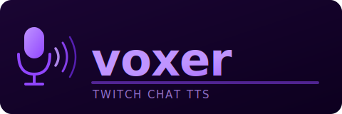

# twitch-voxer



A self-hosted Twitch chat Text-to-Speech bot that streams synthesised audio to an OBS browser source via WebSocket. Every chat message is announced in the detected language, each chatter is automatically assigned a persistent voice, bots and links are handled gracefully, and a scheduler posts rotating community messages to chat on a configurable interval.

---

## Running

**Locally** (requires Python ≥ 3.14, uv, and ffmpeg):

```bash
git clone https://github.com/your-username/twitch-voxer.git
cd twitch-voxer
uv sync
cp .env.example .env   # fill in your Twitch credentials
uv run main.py
```

**With Docker:**

```bash
cp .env.example .env   # fill in your Twitch credentials
mkdir -p data && cp messages.json data/
docker compose up --build
```

The server starts on `http://localhost:8080`. Add that URL as an OBS browser source — TTS audio plays there automatically.

> First run downloads the Supertonic TTS model and may take a minute.

See [Getting Twitch Credentials](#getting-twitch-credentials) if you don't have tokens yet.

---

## Features

- **TTS for every chatter** — powered by [Supertonic](https://github.com/supertonic-ai/supertonic); supports voices M1–M3 and F1–F3.
- **Persistent voice assignment** — each Twitch username keeps the same randomly-assigned voice across sessions (stored in a local JSON file via pickledb).
- **Language detection** — automatically detects Ukrainian (`uk`) and English (`en`); defaults to Ukrainian. Announcements are phrased in the detected language.
- **Message normalisation**
  - URLs are replaced with a spoken phrase (*"see link in the chat"* / *"дивіться посилання в чаті"*).
  - Common abbreviations are expanded (`wtf` → *"what the f"*, `asap` → *"as soon as possible"*, `гг` → *"гарна гра"*, `хз` → *"хто зна"*, and many more — language-aware).
  - Laugh expressions (`lol`, `kek`, `хаха`, `азаз`, …) are converted to the TTS `<laugh>` expression tag.
- **Bot filtering** — well-known bot accounts (StreamElements, Nightbot, Moobot, …) and any username containing "bot" are silently skipped.
- **WebSocket audio streaming** — the synthesised MP3 is served over HTTP and pushed to connected browser clients via WebSocket. Audio files are deleted server-side as soon as the client confirms playback is complete.
- **OBS browser source** — the built-in transparent page auto-connects, queues audio, and plays it sequentially with exponential-backoff reconnection (no user interaction required; OBS CEF bypasses autoplay restrictions).
- **Scheduled messages** — posts rotating messages to chat every N seconds (configurable). Messages are read from `messages.json` at runtime — no restart needed to add or remove entries.
- **Colourful logging** — structured, colour-coded terminal output via `colorlog`.

---

## Architecture

```
Twitch EventSub
      │
      ▼
   VoxBot          (twitchio AutoBot — Twitch adapter)
      │
      ▼
MessageHandler     (business logic: lang detect, voice assign, normalise)
      │
      ▼
  TTSService       (Supertonic WAV synthesis → ffmpeg MP3 conversion)
      │
      ▼
 AudioServer       (Starlette: HTTP static files + WebSocket broadcast)
      │  ws://
      ▼
OBS Browser Source (transparent page, sequential audio queue)

Scheduler ──────► Twitch chat (periodic community messages, no TTS)
```

---

## Prerequisites

| Tool | Version | Notes |
|------|---------|-------|
| Python | ≥ 3.14 | |
| [uv](https://docs.astral.sh/uv/getting-started/installation/) | latest | dependency & venv management |
| ffmpeg | any | WAV → MP3 conversion (`apt install ffmpeg` / `brew install ffmpeg`) |
| Twitch application | — | see [Getting credentials](#getting-twitch-credentials) |

---

## Getting Twitch Credentials

You need four values: `CLIENT_ID`, `CLIENT_SECRET`, `ACCESS_TOKEN`, and `REFRESH_TOKEN`. All of them belong to the **bot account** (the Twitch account that will post messages in chat).

### 1. Register a Twitch application

1. Log in to the [Twitch Dev Console](https://dev.twitch.tv/console/apps) with your **bot account**.
2. Click **Register Your Application**.
3. Fill in:
   - **Name** — anything (e.g. `my-voxer-bot`)
   - **OAuth Redirect URLs** — `http://localhost:3000`
   - **Category** — *Chat Bot*
4. Click **Create**, then **Manage**.
5. Copy the **Client ID** and generate + copy the **Client Secret**.

### 2. Obtain a User Access Token

The bot needs a token with the following scopes: `chat:read`, `chat:edit`, `channel:bot`, `user:write:chat`.

**Option A — Twitch CLI (recommended)**

```bash
# Install: https://dev.twitch.tv/docs/cli/install
twitch configure          # enter your Client ID and Secret when prompted
twitch token -u -s "chat:read chat:edit channel:bot user:write:chat"
```

Authorise in the browser that opens. The CLI prints an `access_token` and a `refresh_token` — copy both.

**Option B — Manual Authorization Code flow**

Open this URL in a browser logged in as the **bot account**:

```
https://id.twitch.tv/oauth2/authorize
  ?client_id=YOUR_CLIENT_ID
  &redirect_uri=http://localhost:3000
  &response_type=code
  &scope=chat:read+chat:edit+channel:bot+user:write:chat
```

After approving, you are redirected to `http://localhost:3000?code=XXXX`. Extract the `code` and exchange it:

```bash
curl -X POST https://id.twitch.tv/oauth2/token \
  -d "client_id=YOUR_CLIENT_ID" \
  -d "client_secret=YOUR_CLIENT_SECRET" \
  -d "code=CODE_FROM_REDIRECT" \
  -d "grant_type=authorization_code" \
  -d "redirect_uri=http://localhost:3000"
```

The JSON response contains `access_token` and `refresh_token`.

---

## Quick Start — Local

### 1. Clone and install dependencies

```bash
git clone https://github.com/your-username/twitch-voxer.git
cd twitch-voxer
uv sync
```

### 2. Create the environment file

```bash
cp .env.example .env   # or create .env from scratch — see Configuration Reference below
```

Minimal `.env`:

```dotenv
TWITCH_CLIENT_ID=your_client_id_here
TWITCH_CLIENT_SECRET=your_client_secret_here
TWITCH_ACCESS_TOKEN=your_access_token_here
TWITCH_REFRESH_TOKEN=your_refresh_token_here
TWITCH_BOT_USERNAME=your_bot_account_login
```

### 3. Prepare the data files

`voices.json` is created automatically on first run.

Create `messages.json` with the messages the scheduler will rotate through:

```json
{
  "messages": [
    "Welcome to the stream! 👋",
    "Don't forget to join the Discord — link in the chat!",
    "Follow the channel and enable notifications so you never miss a stream! 🔔"
  ]
}
```

### 4. Run

```bash
uv run main.py
```

The server starts on `http://0.0.0.0:8080`. Open `http://localhost:8080` in a browser (or add it as an OBS browser source) to receive TTS audio.

The first run downloads the Supertonic TTS model — this may take a minute.

---

## Docker

### Build and run with docker-compose

```bash
# 1. Fill in your credentials
cp .env.example .env

# 2. Put your messages file into the data directory
mkdir -p data
cp messages.json data/

# 3. Build and start
docker compose up --build
```

The compose file mounts `./data` to `/data` inside the container (persists voice assignments and messages between restarts) and uses a named Docker volume for the Supertonic model cache so it survives container rebuilds.

```yaml
# Paths set by docker-compose.yml
VOXER_DB_PATH:       /data/voices.json
VOXER_MESSAGES_PATH: /data/messages.json
VOXER_AUDIO_DIR:     /data/audio
```

The container exposes port **8080**.

---

## OBS Browser Source Setup

1. In OBS, add a **Browser Source**.
2. Set the URL to `http://localhost:8080` (or `http://<server-ip>:8080` if the bot runs on another machine).
3. Set width/height to anything — the page is fully transparent (e.g. 1×1 is fine).
4. Disable **"Shutdown source when not visible"** so the WebSocket stays connected while switching scenes.
5. Done. Audio plays automatically; OBS's built-in Chromium browser does not enforce the autoplay policy.

---

## Configuration Reference

| Variable | Default | Description |
|----------|---------|-------------|
| `TWITCH_CLIENT_ID` | *(required)* | Twitch application Client ID |
| `TWITCH_CLIENT_SECRET` | *(required)* | Twitch application Client Secret |
| `TWITCH_ACCESS_TOKEN` | *(required)* | Bot account User Access Token |
| `TWITCH_REFRESH_TOKEN` | *(required)* | Bot account Refresh Token |
| `TWITCH_BOT_USERNAME` | *(required)* | Login name of the bot Twitch account |
| `VOXER_DB_PATH` | `voices.json` | Path to the pickledb file storing username → voice mappings |
| `VOXER_MESSAGES_PATH` | `messages.json` | Path to the scheduled messages file |
| `VOXER_AUDIO_DIR` | `audio` | Directory where MP3 files are temporarily stored |
| `VOXER_SERVER_HOST` | `0.0.0.0` | Host the HTTP/WebSocket server binds to |
| `VOXER_SERVER_PORT` | `8080` | Port the server listens on |
| `VOXER_SCHEDULER_INTERVAL` | `600` | Seconds between scheduled messages |
| `VOXER_SCHEDULER_INITIAL_DELAY` | `10` | Seconds to wait before the first scheduled message |

---

## Scheduled Messages

Edit `messages.json` (or `data/messages.json` in Docker) at any time — the scheduler reloads the file on every cycle without requiring a restart:

```json
{
  "messages": [
    "First message",
    "Second message",
    "Third message"
  ]
}
```

Messages are posted to chat in round-robin order. They are **not** read aloud via TTS — only sent as chat text.

---

## Voice Assignment

On their first message, each chatter is randomly assigned one of six voices: `M1`, `M2`, `M3` (male) or `F1`, `F2`, `F3` (female). The assignment is persisted in `voices.json` and reused for every subsequent message from that chatter.

---

## Project Structure

```
twitch-voxer/
├── main.py                  # Entrypoint
├── voxer/
│   ├── __init__.py          # Composition root — wires all components together
│   ├── config.py            # Environment variable loading
│   ├── bot.py               # Twitch adapter (twitchio AutoBot + EventSub)
│   ├── handler.py           # Business logic (lang detect, voice assign, normalise, TTS)
│   ├── tts.py               # TTS infrastructure (Supertonic WAV + ffmpeg MP3)
│   ├── server.py            # HTTP + WebSocket server (Starlette)
│   ├── scheduler.py         # Periodic chat message scheduler
│   ├── log.py               # Colourful logging setup
│   └── static/
│       └── index.html       # OBS browser source page
├── messages.json            # Scheduled messages (pickledb format)
├── docker-compose.yml
├── Dockerfile
└── pyproject.toml
```

---

## License

MIT
