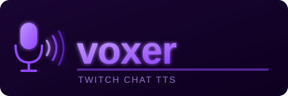

# twitch-voxer



A self-hosted Twitch chat Text-to-Speech bot that streams synthesised audio to an OBS browser source via WebSocket. Every chat message is announced in the detected language, each chatter is automatically assigned a persistent voice, bots and links are handled gracefully, and a scheduler posts random weighted community messages to chat.

---

## Running

**Locally** (requires Python ≥ 3.14, uv, and ffmpeg):

```bash
git clone https://github.com/your-username/twitch-voxer.git
cd twitch-voxer
uv sync
cp .env.example .env   # fill in your Twitch credentials
mkdir -p data
uv run main.py
```

**With Docker:**

```bash
cp .env.example .env   # fill in TWITCH_CLIENT_ID and TWITCH_CLIENT_SECRET
mkdir -p data
docker compose up --build
# then open the authorization URL printed in the log (one time only)
```

The server starts on `http://localhost:8080`. Add that URL as an OBS browser source — TTS audio plays there automatically.

> First run downloads the Supertonic TTS model and may take a minute.

See [Getting Twitch Credentials](#getting-twitch-credentials) if you haven't created a Twitch application yet.

---

## Features

- **TTS for every chatter** — powered by [Supertonic](https://github.com/supertonic-ai/supertonic); ten built-in voices (M1–M5, F1–F5) plus optional custom voices from the `voices/` directory.
- **Persistent voice assignment** — each Twitch username keeps the same randomly-assigned voice across sessions (stored in a local JSON file via pickledb).
- **Language detection** — automatically detects Ukrainian (`uk`) and English (`en`); defaults to Ukrainian. Announcements are phrased in the detected language.
- **Message normalisation**
  - URLs are replaced with a spoken phrase (*"see link in the chat"* / *"дивіться посилання в чаті"*).
  - Common abbreviations are expanded (`wtf` → *"what the f"*, `asap` → *"as soon as possible"*, `гг` → *"гарна гра"*, `хз` → *"хто зна"*, and many more — language-aware).
  - Laugh expressions (`lol`, `kek`, `хаха`, `азаз`, …) are converted to the TTS `<laugh>` expression tag.
- **Bot filtering** — well-known bot accounts (StreamElements, Nightbot, Moobot, …) and any username containing "bot" are silently skipped.
- **WebSocket audio streaming** — the synthesised MP3 is served over HTTP and pushed to connected browser clients via WebSocket. Audio files are deleted server-side as soon as the client confirms playback is complete.
- **OBS browser source** — the built-in transparent page auto-connects, queues audio, and plays it sequentially with exponential-backoff reconnection (no user interaction required; OBS CEF bypasses autoplay restrictions).
- **Scheduled messages** — posts random weighted messages to chat. Messages and per-hour frequencies are read from `data/messages.json` at runtime — no restart needed to add or remove entries.
- **Colourful logging** — structured, colour-coded terminal output via `colorlog`.

---

## Architecture

```
Twitch EventSub
      │
      ▼
   VoxBot          (twitchio AutoBot — Twitch adapter)
      │
      ▼
MessageHandler     (business logic: lang detect, voice assign, normalise)
      │
      ▼
  TTSService       (Supertonic WAV synthesis → ffmpeg MP3 conversion)
      │
      ▼
 AudioServer       (Starlette: HTTP static files + WebSocket broadcast)
      │  ws://
      ▼
OBS Browser Source (transparent page, sequential audio queue)

Scheduler ──────► Twitch chat (periodic community messages, no TTS)
```

---

## Prerequisites

| Tool | Version | Notes |
|------|---------|-------|
| Python | ≥ 3.14 | |
| [uv](https://docs.astral.sh/uv/getting-started/installation/) | latest | dependency & venv management |
| ffmpeg | any | WAV → MP3 conversion (`apt install ffmpeg` / `brew install ffmpeg`) |
| Twitch application | — | see [Getting credentials](#getting-twitch-credentials) |

---

## Getting Twitch Credentials

You need exactly two values: a **Client ID** and a **Client Secret**. Both come from a Twitch *application* — an entry you register once in Twitch's developer console that identifies this bot to Twitch. Register it under the **bot account** (the Twitch account that will post messages in chat).

Account tokens are **not** something you copy anywhere. The bot obtains them for you, once, through OAuth — the standard "sign in with Twitch and approve this app" flow you have seen on other sites — and stores them locally after that.

### 1. Register a Twitch application

1. Log in to the [Twitch Dev Console](https://dev.twitch.tv/console/apps) with your **bot account**.
2. Click **Register Your Application**.
3. Fill in:
   - **Name** — anything (e.g. `my-voxer-bot`)
   - **OAuth Redirect URLs** — `http://localhost:4343/oauth/callback`
     (this must match exactly — it is where Twitch sends the browser back after you approve the app, and the bot listens on port 4343 for it)
   - **Category** — *Chat Bot*
4. Click **Create**, then **Manage**.
5. Copy the **Client ID** and generate + copy the **Client Secret**.

Put both values in your `.env` file as `TWITCH_CLIENT_ID` and `TWITCH_CLIENT_SECRET`.

### 2. First-run authorization (automatic)

Start the bot (`uv run main.py` or `docker compose up`). On the first start there are no account tokens yet, so the bot runs a small one-time authorization server on port **4343** and opens `http://localhost:4343/oauth` in your browser (if it cannot open a browser — for example inside Docker — it prints that URL in the log; open it yourself). Sign in as the **bot account** and approve the application.

That is the whole procedure. The bot saves the resulting tokens to `data/tokens.json` (configurable via `VOXER_TOKEN_FILE`), refreshes them automatically whenever they expire, and re-saves them on every refresh — so you are never asked to authorize again, even across restarts.

The scopes (permissions) requested during authorization are defined in `voxer/bot.py` (`OAUTH_SCOPES`): reading and writing chat, plus follow, subscription, cheer, and raid events.

If you already have a valid access/refresh token pair from an external tool, you can put it in `TWITCH_ACCESS_TOKEN` / `TWITCH_REFRESH_TOKEN` to seed the token file and skip the browser step entirely — but normally you leave those empty.

`voxer/fetch_emotes.py` (the emote-image downloader) reuses the same token file: it refreshes the stored token and writes the rotated pair back, falling back to the env token or its own browser flow only when the file has nothing usable.

---

## Quick Start — Local

### 1. Clone and install dependencies

```bash
git clone https://github.com/your-username/twitch-voxer.git
cd twitch-voxer
uv sync
```

### 2. Create the environment file

```bash
cp .env.example .env   # or create .env from scratch — see Configuration Reference below
```

Minimal `.env`:

```dotenv
TWITCH_CLIENT_ID=your_client_id_here
TWITCH_CLIENT_SECRET=your_client_secret_here
TWITCH_BOT_USERNAME=your_bot_account_login
```

Account tokens are not part of the configuration — the first run walks you through a one-time browser authorization and stores them in `data/tokens.json` (see [Getting Twitch Credentials](#getting-twitch-credentials)).

### 3. Prepare the data files

`voices.json` is created automatically on first run.

Create `data/messages.json` with the messages the scheduler will randomly post:

```json
{
  "messages": [
    {
      "text": "Welcome to the stream! 👋",
      "frequency_per_hour": 1
    },
    {
      "text": "Time for a stretch break.",
      "frequency_per_hour": 0.5
    }
  ]
}
```

### 4. Run

```bash
uv run main.py
```

The server starts on `http://0.0.0.0:8080`. Open `http://localhost:8080` in a browser (or add it as an OBS browser source) to receive TTS audio.

The first run downloads the Supertonic TTS model — this may take a minute.

---

## Docker

### Build and run with docker-compose

```bash
# 1. Fill in your Twitch application credentials.
#    Only TWITCH_CLIENT_ID and TWITCH_CLIENT_SECRET are required —
#    account tokens are obtained automatically on the first start (see below).
cp .env.example .env

# 2. Create the data directory (persistent state lives here)
mkdir -p data

# 3. Build and start
docker compose up --build
```

### First-run authorization

The bot needs permission to act as your bot account. On the first start it has
no tokens yet, so it launches a small one-time authorization server on port
**4343** and prints a URL like `http://localhost:4343/oauth` in its log. Open
that URL once in a browser, sign in with the bot account, and approve the
application. Two things must line up for this to work:

- In the [Twitch dev console](https://dev.twitch.tv/console/apps), your
  application's OAuth redirect URL must be set to
  `http://localhost:4343/oauth/callback`.
- Port 4343 must be reachable from your browser — the compose file already
  publishes it.

The tokens are then saved to `./data/tokens.json`, refreshed automatically,
and reused on every later start — you will not be asked again.

### What the container looks like

The image bundles the default voice styles (`voices/`) and emote sounds
(`emotes/`), so an image pulled from a registry works on its own, without a
checkout of this repository. If you want to customize them, uncomment the
`./voices` and `./emotes` bind mounts in `docker-compose.yml` to use your
local copies instead.

The compose file mounts `./data` to `/data` inside the container (voice
assignments, scheduled messages, generated audio, and the OAuth tokens all
persist there between restarts) and uses a named Docker volume for the
Supertonic model cache so it survives container rebuilds.

```yaml
# Paths set by docker-compose.yml
VOXER_DB_PATH:       /data/voices.json
VOXER_MESSAGES_PATH: /data/messages.json
VOXER_AUDIO_DIR:     /data/audio
VOXER_TOKEN_FILE:    /data/tokens.json
```

The container exposes port **8080** (overlay web server) and port **4343**
(the one-time authorization flow described above).

### Multi-architecture builds (amd64 + arm64)

The image builds for both `linux/amd64` and `linux/arm64` (e.g. Raspberry Pi 4/5,
AWS Graviton, Apple Silicon servers). On an x86_64 host, arm64 builds run under
QEMU emulation, which needs a one-time setup:

```bash
# 1. Register the arm64 emulator with the kernel (one-time, survives reboots
#    until the next kernel update)
docker run --privileged --rm tonistiigi/binfmt --install arm64

# 2. Create a builder that can produce multi-platform images (one-time)
docker buildx create --name multiarch --driver docker-container
```

Then either build both architectures at once via the platforms already declared
in `docker-compose.yml` (add `--push` to publish to a registry — the local
Docker store cannot hold a two-architecture image without containerd):

```bash
docker buildx bake --builder multiarch
```

Or build only the arm64 image and load it into the local Docker store:

```bash
docker buildx build --platform linux/arm64 -t twitch-voxer:arm64 --load .
```

Emulated arm64 builds are noticeably slower than native ones — expect several
minutes for the dependency-install step.

---

## OBS Browser Source Setup

Two overlay pages are served; both play the same audio and show the same
"now playing" card (avatar, username, and the message's emotes) — they differ
only in visual style:

- `http://localhost:8080/` — the full overlay: 3D speaker model, glitch
  effects, and emotes bursting from the center of the screen.
- `http://localhost:8080/simple` — a lighter overlay: no 3D scene, only emote
  particle effects (rain, sparks, and similar). Use this one if the full
  overlay costs too much GPU on your streaming machine.

Setup:

1. In OBS, add a **Browser Source**.
2. Set the URL to `http://localhost:8080` or `http://localhost:8080/simple`
   (replace `localhost` with the server's IP if the bot runs on another
   machine).
3. Set width/height to your canvas size (e.g. 1920×1080) — the page
   background is fully transparent, so it overlays your scene.
4. Disable **"Shutdown source when not visible"** so the WebSocket stays
   connected while switching scenes.
5. Done. Audio plays automatically; OBS's built-in Chromium browser does not
   enforce the autoplay policy.

### URL parameters

Both pages accept optional query parameters — extra settings appended to the
URL after a `?`:

| Parameter | Example | Effect |
|-----------|---------|--------|
| `volume` | `http://localhost:8080/?volume=0.5` | Playback volume from `0` (silent) to `1` (full, the default). Values outside that range are clamped. |
| `debug` | `http://localhost:8080/?debug=1` | `debug=1` forces the connection status pill visible; `debug=0` forces it hidden. |

Parameters combine with `&`: `http://localhost:8080/simple?volume=0.7&debug=1`.

### Status pill

A small pill in the top-left corner shows the connection state ("connected",
"reconnecting in Ns" after a dropped connection) and, when messages arrive
faster than they can be spoken, the current queue depth. The pill hides
itself automatically inside OBS so it never appears on stream — it is only
shown when you open the page in a regular browser, and `?debug=` overrides
this in either direction (see the table above).

### Testing in a regular browser

Regular browsers (unlike OBS) block audio until you interact with the page —
this is the browser's autoplay policy, a protection against sites that play
sound uninvited. When that happens the overlay shows a **"Click anywhere to
enable audio"** message; click (or press any key) once and playback starts,
including the message that was blocked. Nothing is lost: blocked audio stays
at the front of the queue until you interact.

---

## Configuration Reference

| Variable | Default | Description |
|----------|---------|-------------|
| `TWITCH_CLIENT_ID` | *(required)* | Twitch application Client ID |
| `TWITCH_CLIENT_SECRET` | *(required)* | Twitch application Client Secret |
| `TWITCH_ACCESS_TOKEN` | *(empty)* | Optional seed token — used once to populate the token file when it does not exist yet, skipping the browser flow. Normally leave empty. |
| `TWITCH_REFRESH_TOKEN` | *(empty)* | Optional seed refresh token, paired with `TWITCH_ACCESS_TOKEN` |
| `TWITCH_BOT_USERNAME` | *(required)* | Login name of the bot Twitch account. No default — the bot runs as whichever account this names, so a wrong value fails silently rather than loudly |
| `VOXER_OAUTH_HOST` | `localhost` | Host the one-time OAuth authorization server binds to (`0.0.0.0` in Docker so the published port reaches it) |
| `VOXER_OAUTH_PORT` | `4343` | Port of the OAuth authorization server — must match the redirect URL registered in the Twitch dev console |
| `VOXER_OAUTH_REDIRECT_URL` | `http://localhost:4343/oauth/callback` | The full OAuth Redirect URL — must match exactly what is registered in the Twitch dev console; set an `https://` URL for reverse-proxy setups (non-localhost hosts must be `https://`; validated at startup) |
| `VOXER_TOKEN_FILE` | `data/tokens.json` | Where obtained OAuth tokens are persisted and auto-refreshed |
| `VOXER_DB_PATH` | `data/voices.json` | Path to the pickledb file storing username → voice mappings |
| `VOXER_MESSAGES_PATH` | `data/messages.json` | Path to the scheduled messages file |
| `VOXER_AUDIO_DIR` | `audio` | Directory where MP3 files are temporarily stored |
| `VOXER_SERVER_HOST` | `0.0.0.0` | Host the HTTP/WebSocket server binds to |
| `VOXER_SERVER_PORT` | `8080` | Port the server listens on |
| `VOXER_SCHEDULER_EMPTY_RETRY_DELAY` | `600` | Delay before re-checking when the scheduled-message list is empty (`VOXER_SCHEDULER_INTERVAL` is a deprecated alias) |
| `VOXER_SCHEDULER_INITIAL_DELAY` | `10` | Seconds to wait before the first scheduled message |
| `VOXER_MESSAGE_QUEUE_MAXSIZE` | `20` | How many messages may wait for speech synthesis at once. Synthesis takes seconds per message, so this bound keeps the overlay from falling minutes behind a busy chat: once the queue is full, new chat messages are dropped (and logged), while channel events wait for room. |

---

## Scheduled Messages

Edit `data/messages.json` at any time — the scheduler reloads the file on every cycle without requiring a restart:

```json
{
  "messages": [
    {
      "text": "First message",
      "frequency_per_hour": 1
    },
    {
      "text": "Stretch and drink water.",
      "frequency_per_hour": 0.5
    }
  ]
}
```

Messages are posted to chat randomly, weighted by `frequency_per_hour`. A value of `1` means roughly once per hour; `0.5` means roughly once every two hours. They are **not** read aloud via TTS — only sent as chat text.

---

## Voice Assignment

On their first message, each chatter is randomly assigned a voice from the pool: the ten built-in Supertonic voices `M1`–`M5` (male) and `F1`–`F5` (female), plus any custom voices found as `*.json` files in the `voices/` directory. The assignment is persisted in `data/voices.json` and reused for every subsequent message from that chatter. If a stored voice disappears from the pool (for example, a custom voice file was deleted), that chatter is quietly given a new one.

---

## Project Structure

```
twitch-voxer/
├── main.py                  # Entrypoint (calls voxer.app.main)
├── voxer/
│   ├── __init__.py          # Package docstring + __version__ (import-light)
│   ├── app.py               # Composition root — wires all components together
│   ├── config.py            # Environment variable loading
│   ├── bot.py               # Twitch adapter (twitchio AutoBot + EventSub + OAuth flow)
│   ├── handler.py           # Pipeline orchestration (message → audio)
│   ├── textnorm.py          # Pure text rules (bot filter, emoji, normalisation, abbrevs)
│   ├── stores.py            # pickledb persistence (VoiceStore, AnnounceTracker, EmoteStore)
│   ├── models.py            # Shared dataclasses (QueuedMessage, BroadcastEvent, ...)
│   ├── tts.py               # TTS infrastructure (Supertonic WAV + ffmpeg MP3)
│   ├── fetch_emotes.py      # Downloads emote images into emotes/emotes.db
│   ├── server.py            # HTTP + WebSocket server (Starlette)
│   ├── scheduler.py         # Periodic chat message scheduler
│   ├── events.py            # Channel-event announcement strings
│   ├── log.py               # Colourful logging setup
│   └── static/
│       ├── index.html       # Full OBS overlay (3D speaker + effects)
│       ├── simple.html      # Lightweight overlay
│       └── overlay.js       # Shared overlay runtime (queueing, WebSocket, playback)
├── tests/                   # Unit tests (textnorm, scheduler, events, stores, server)
├── data/
│   └── messages.json        # Scheduled messages (pickledb format)
├── docker-compose.yml
├── Dockerfile
└── pyproject.toml
```

---

## Development

Run the unit test suite (47 tests covering text normalisation, the scheduler, event strings, the persistence stores, and the server's path guard):

```bash
uv run pytest
```

---

## License

MIT
