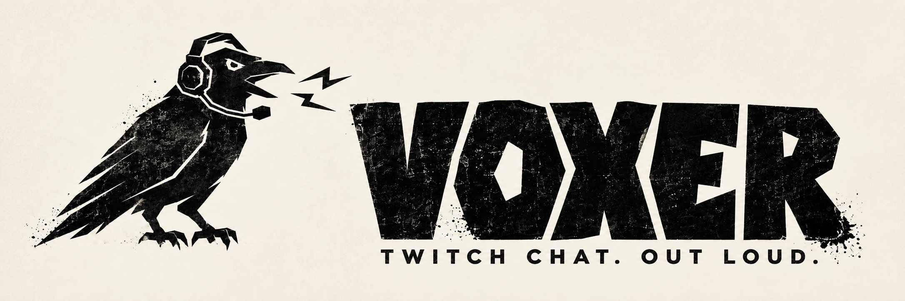

<p align="center">
  
</p>

<h1 align="center">VOXER</h1>

<p align="center"><strong>Your chat has something to say. Let it.</strong></p>
<p align="center">Self-hosted Twitch text-to-speech with a voice for every chatter and overlays made for OBS.</p>

<p align="center">
  <a href="#quick-start">🚀 Quick start</a> ·
  <a href="#docker">🐳 Docker</a> ·
  <a href="#obs">🎬 OBS setup</a> ·
  <a href="#configuration">⚙️ Configuration</a> ·
  <a href="#troubleshooting">🛠️ Help</a>
</p>

<p align="center">
  
</p>

<h2 align="center">🎙️ Give Chat a Voice</h2>

Keep your eyes on the game and your ears on chat. Voxer turns Twitch messages into speech on your machine, then plays them through a transparent OBS browser source. Each chatter gets a persistent voice, so your regulars sound like your regulars.

| What you get | What it does |
| :--- | :--- |
| 🗣️ Distinct voices | Ten built-in voices plus bundled custom styles, with assignments saved between streams. |
| 🌍 English & Ukrainian | Automatic language detection, spoken usernames, expanded abbreviations, and readable link announcements. Other languages fall back to Ukrainian. |
| 🎉 Channel moments | Spoken follow, subscription, cheer, and raid announcements. Event announcement text is Ukrainian. |
| 🎬 Two overlay styles | A 3D speaker with glitch effects, or a lighter particle overlay. Both show the current chatter and support reduced motion. |
| 💬 Community reminders | Editable, weighted scheduled messages posted directly to chat. |
| 🏠 Your own setup | Local [Supertonic](https://pypi.org/project/supertonic/) speech synthesis, saved settings, and automatic Twitch token refresh. No external TTS API key. |

**One account, one channel:** Voxer runs in the channel owned by `TWITCH_BOT_USERNAME`. Use your streaming account's lowercase login and authorize that same account. Messages sent by that account are skipped, along with known bots and usernames containing `bot`.

<a name="quick-start"></a>
<h2 align="center">🚀 Quick Start</h2>

For a local install, you'll need [uv](https://docs.astral.sh/uv/getting-started/installation/), Python **3.14**, and **ffmpeg**. uv can [install Python for you](https://docs.astral.sh/uv/guides/install-python/). Install ffmpeg with your package manager, such as `sudo apt install ffmpeg` on Ubuntu or `brew install ffmpeg` on macOS.

Prefer containers? Create your Twitch application below, then jump to [Docker](#docker).

<h3 align="center">1 · Connect your Twitch account</h3>

1. Open the [Twitch Developer Console](https://dev.twitch.tv/console/apps) and register an application. Twitch requires a verified email and two-factor authentication; see its [registration guide](https://dev.twitch.tv/docs/authentication/register-app/).
2. Set the OAuth redirect URL to **`http://localhost:4343/oauth/callback`**.
3. Open **Manage** for your application. Copy the **Client ID** and create a **Client Secret**.

<h3 align="center">2 · Install and configure</h3>

```bash
git clone https://github.com/w0rxbend/twitch-voxer.git
cd twitch-voxer
uv python install 3.14
uv sync --locked
cp .env.example .env
mkdir -p data
```

Fill in these three values in `.env`:

```dotenv
TWITCH_CLIENT_ID=your_client_id
TWITCH_CLIENT_SECRET=your_client_secret
TWITCH_BOT_USERNAME=your_channel_login
```

Leave the access and refresh token fields empty for the normal browser sign-in flow. Keep `.env` and `data/tokens.json` private.

**Before you start:** review [data/messages.json](data/messages.json). Its messages are posted to your chat, beginning after the startup delay. To disable reminders, replace its contents with:

```json
{"messages": []}
```

<h3 align="center">3 · Go live with Voxer</h3>

```bash
uv run --frozen twitch-voxer
```

Open the authorization URL shown in the terminal, usually **`http://localhost:4343/oauth`**, and sign in as the account configured above. Saved tokens are refreshed automatically and survive restarts; you may need to authorize again if access is revoked.

The first run downloads the speech model. Once startup completes, add **`http://localhost:8080/simple`** as an OBS browser source using the [setup below](#obs). Keep an overlay connected and send a message from another Twitch account to hear it speak.

<a name="docker"></a>
<h2 align="center">🐳 Run with Docker</h2>

Docker includes Python and ffmpeg. Clone the repository, enter its directory, copy `.env.example` to `.env`, and fill in the same three Twitch settings from [Quick Start](#quick-start).

Generate a separate overlay secret:

```bash
docker run --rm python:3.14-slim python -c "import secrets; print(secrets.token_urlsafe(32))"
```

Paste the result into `.env` as `VOXER_OVERLAY_TOKEN`. This is required by the container configuration; use a fresh secret, separate from your Twitch credentials.

```dotenv
VOXER_OVERLAY_TOKEN=paste_the_generated_value_here
```

Review or disable the scheduled messages as described above, then start the service:

```bash
mkdir -p data
docker compose up -d --build
docker compose logs -f voxer
```

On Linux, `data/` must be writable by the container's user, **UID 1000**. Open the authorization URL from the logs on the Docker host and approve your Twitch account. Use **`http://localhost:8080/simple?token=YOUR_TOKEN`** in OBS.

The supplied Compose configuration publishes ports **8080** and **4343** on localhost only. Your settings and tokens persist in `./data`; the downloaded model persists in a named Docker volume. Custom voice files and emote sounds are bundled in the image. Uncomment the corresponding mounts in [docker-compose.yml](docker-compose.yml) to use your own local copies.

| Task | Command |
| :--- | :--- |
| View logs | `docker compose logs -f voxer` |
| Stop | `docker compose down` |
| Apply `.env` changes | `docker compose up -d --force-recreate` |
| Update | `git pull --ff-only`, then `docker compose up -d --build` |

<a name="obs"></a>
<h2 align="center">🎬 Add It to OBS</h2>

| Overlay | Local URL | Style |
| :--- | :--- | :--- |
| **Full** | `http://localhost:8080/` | 3D speaker, glitches, and emote effects. |
| **Simple** | `http://localhost:8080/simple` | Chatter card and particles with less graphics work. |

1. In OBS, add a [Browser Source](https://obsproject.com/kb/browser-source).
2. Paste an overlay URL. If you configured an overlay token, append `?token=YOUR_TOKEN`.
3. Match the source dimensions to your canvas, for example **1920 × 1080**. The background is transparent.
4. Disable **Shutdown source when not visible** to keep the connection alive while switching scenes.
5. Send a chat message from another account and check the audio in OBS.

At least one overlay must be connected for speech to be generated. Opening both overlays plays audio in both, so use one active audio source if you hear an echo.

<h3 align="center">Make it yours</h3>

| URL option | Example | Effect |
| :--- | :--- | :--- |
| `volume` | `?volume=0.7` | Playback volume from `0` to `1`; default `1`. |
| `debug` | `?debug=1` | Show connection status; `0` hides it. Hidden in OBS by default. |
| `token` | `?token=YOUR_TOKEN` | Sign in to a protected overlay. |

Combine options with `&`, for example:

```text
http://localhost:8080/simple?token=YOUR_TOKEN&volume=0.7&debug=0
```

The token is exchanged for a private browser cookie and removed from the address bar. Keep it in the saved OBS source URL so a fresh browser profile can sign in. Update that URL when you rotate the token.

In a regular browser, click **Enable Audio** or focus it and press Enter/Space if autoplay is blocked. Both overlays follow your system's reduced-motion preference while keeping speech and the chatter card available.

<a name="configuration"></a>
<h2 align="center">⚙️ Tune Your Stream</h2>

Settings come from the environment or `.env`. Restart Voxer after changing them. [`.env.example`](.env.example) contains the full list with explanations; these are the settings you'll most often want to adjust:

| Setting | Default | What it changes |
| :--- | :--- | :--- |
| `VOXER_MESSAGE_QUEUE_MAXSIZE` | `20` | Messages waiting for speech. New messages are dropped when full. |
| `VOXER_MAX_MESSAGE_AGE_SECS` | `60` | Maximum age of queued work, in seconds. |
| `VOXER_USER_COOLDOWN_SECS` | `2` | Minimum gap between accepted messages from one chatter; `0` disables it. |
| `VOXER_MAX_MESSAGE_CHARS` | `500` | Incoming message length limit. |
| `VOXER_MAX_SPEECH_CHARS` | `1000` | Length limit after text expansion. |
| `VOXER_ANNOUNCE_WINDOW_SECS` | `300` | Silence before a chatter's name is spoken again. |
| `VOXER_NO_ANNOUNCE_USERS` | Configured account | Comma-separated logins whose name prefix is skipped. Replaces the default list. |
| `VOXER_EMOTE_SOUND_PATHS` | Two bundled MP3s | Sounds for emote-only messages. An empty value disables them. |
| `VOXER_LOG_LEVEL` | `INFO` | Logging detail. |

<h3 align="center">💬 Scheduled messages</h3>

Edit [data/messages.json](data/messages.json) to choose your community reminders:

```json
{
  "messages": [
    {"text": "Welcome in! Make yourself at home. 👋", "frequency_per_hour": 1},
    {"text": "Hydration check. Take a sip! 💧", "frequency_per_hour": 0.5}
  ]
}
```

Voxer chooses messages randomly, weighted by `frequency_per_hour`. These values set an approximate average, rather than an exact timetable. Reminders are posted as chat text and are not spoken aloud. The file reloads each cycle, so edits do not require a restart.

Use `{"messages": []}` to disable posting. `VOXER_SCHEDULER_INITIAL_DELAY` defaults to **10 seconds**; an empty list is checked again after `VOXER_SCHEDULER_EMPTY_RETRY_DELAY`, default **600 seconds**.

<h3 align="center">🎭 Voices and emotes</h3>

Each new chatter receives a random voice from **M1–M5**, **F1–F5**, and the custom styles in [voices/](voices/). Assignments are saved in `data/voices.json`. Add compatible Supertonic voice-style JSON files to `voices/` and restart to expand the pool.

To populate emote images, stop Voxer and run the cache fetcher from a local installation:

```bash
uv run --frozen voxer-fetch-emotes
```

It reuses your saved Twitch authorization, so run it while the service is stopped. It fetches global emotes and emotes from your own and followed channels; `--include-followers` also scans follower channels. Restart Voxer to load the resulting `emotes/emotes.db` cache. For Docker, enable the `./emotes:/app/emotes:ro` mount after generating the cache on the host.

<details>
<summary><strong>📁 Storage paths and backups</strong></summary>

| Setting | Local default | Contents |
| :--- | :--- | :--- |
| `VOXER_DB_PATH` | `data/voices.json` | Chatter-to-voice assignments. |
| `VOXER_TIMESTAMPS_DB_PATH` | `data/timestamps.json` | Recent announcement timestamps. |
| `VOXER_TOKEN_FILE` | `data/tokens.json` | Private Twitch access and refresh tokens. |
| `VOXER_MESSAGES_PATH` | `data/messages.json` | Scheduled chat messages. |
| `VOXER_VOICES_DIR` | `voices` | Custom voice styles. |
| `VOXER_EMOTES_DB_PATH` | `emotes/emotes.db` | Generated emote-image cache. |
| `VOXER_AUDIO_DIR` | `audio` | Temporary generated clips. |

Back up the `data/` directory securely to preserve your settings and authorization. Generated audio and the emote cache can be recreated. Docker overrides several paths to use `/data`; see the Compose file before changing container paths.

</details>

<details>
<summary><strong>🔌 Server settings and playback limits</strong></summary>

| Setting | Default | Purpose |
| :--- | :--- | :--- |
| `VOXER_SERVER_HOST` | `127.0.0.1` | Overlay bind address. |
| `VOXER_SERVER_PORT` | `8080` | Overlay HTTP and WebSocket port. |
| `VOXER_OVERLAY_TOKEN` | Empty | Required for non-loopback listeners; 32–256 URL-safe characters. |
| `VOXER_ALLOWED_HOSTS` | Empty | Additional exact hostnames/IPs; comma-separated, without schemes, ports, or wildcards. |
| `VOXER_TRUSTED_PROXIES` | Empty | Exact proxy IPs or narrow CIDRs allowed to supply forwarded headers. |
| `VOXER_MAX_WS_CLIENTS` | `8` | Maximum overlay connections. |
| `VOXER_MAX_PENDING_PER_CLIENT` | `64` | Outstanding clips per overlay. |
| `VOXER_WS_SEND_TIMEOUT` | `5` | Seconds allowed to send to an overlay before disconnecting it. |
| `VOXER_AUDIO_MAX_AGE_SECS` | `300` | Lifetime of outstanding playback receipts and age threshold for orphaned clips. |
| `VOXER_AUDIO_SWEEP_INTERVAL_SECS` | `300` | Interval between audio cleanup sweeps. |
| `VOXER_OAUTH_HOST` | `localhost` | Authorization callback bind address. |
| `VOXER_OAUTH_PORT` | `4343` | Authorization callback port. |
| `VOXER_OAUTH_REDIRECT_URL` | `http://localhost:4343/oauth/callback` | Must exactly match the registered Twitch redirect URL. Non-localhost callbacks require HTTPS. |

Keep audio lifetimes long enough for queued playback. The `/healthz` endpoint reports HTTP service liveness; it does not confirm Twitch authorization or speech readiness.

</details>

<details>
<summary><strong>🌐 Use another machine or a reverse proxy</strong></summary>

For an OBS machine on your LAN, bind `VOXER_SERVER_HOST` to the server's LAN address, configure a fresh `VOXER_OVERLAY_TOKEN`, and add any hostname used in the OBS URL to `VOXER_ALLOWED_HOSTS`. If using Docker, also change its localhost-only port publishing deliberately. Keep the OAuth callback port private.

Use HTTPS/WSS when crossing an untrusted network. For a TLS reverse proxy on the same host as a local Voxer process, a typical configuration is:

```dotenv
VOXER_SERVER_HOST=127.0.0.1
VOXER_OVERLAY_TOKEN=paste_a_separate_random_secret_here
VOXER_ALLOWED_HOSTS=tts.example.org
VOXER_TRUSTED_PROXIES=127.0.0.1,::1
```

The proxy must preserve `Host`, replace `X-Forwarded-For` and `X-Forwarded-Proto`, and support WebSocket upgrades. Trust the proxy's actual source IP when it runs in a container; avoid broad trusted ranges. Keep the backend port private, and omit query strings from proxy access logs so overlay sign-in tokens are not recorded.

If you also proxy authorization, register the exact HTTPS callback URL in Twitch and set `VOXER_OAUTH_REDIRECT_URL` to match. The default `localhost` authorization URL must be opened on the server host, or reached through a local port tunnel.

</details>

<a name="troubleshooting"></a>
<h2 align="center">🛠️ A Little Help</h2>

| Something's off | Try this |
| :--- | :--- |
| No speech | Connect an overlay, wait for model startup, and test from another account. Your configured account's own messages are skipped. |
| Browser is silent | Click **Enable Audio**, check `volume`, and check the OBS mixer. |
| Overlay says unauthorized | Use `?token=YOUR_TOKEN` with the current overlay secret. |
| Invalid host | Add the hostname from your OBS URL to `VOXER_ALLOWED_HOSTS`, without a scheme or port. |
| Twitch authorization fails | Check the Client ID, secret, exact callback URL, and that you signed in as `TWITCH_BOT_USERNAME`. |
| Docker cannot save settings | Check that `data/` exists and is writable by UID 1000. |
| Speech trails behind chat | Lower the queue size or maximum message age, or increase the per-user cooldown. |
| No emote images | Generate the emote cache, mount it if using Docker, then restart. |
| Speech conversion fails | Confirm `ffmpeg` is available on your PATH. |

For more detail, set `VOXER_LOG_LEVEL=DEBUG` and restart. You can also [open an issue](https://github.com/w0rxbend/twitch-voxer/issues) with the relevant error and steps to reproduce it; leave out secrets and private state files.

<details>
<summary><strong>🧪 Working on the code? Run the checks</strong></summary>

```bash
uv sync --locked --dev
uv run --frozen ruff check
uv run --frozen ruff format --check
uv run --frozen pyright
uv run --frozen pytest -q
node tests/test_overlay.cjs
```

Optional browser checks for both overlays:

```bash
uv run --frozen --with playwright python -m playwright install chromium
uv run --frozen --with playwright python tests/browser_overlay.py
```

These use an isolated local server and temporary audio, without Twitch authorization or model downloads. Screenshots are saved to the temporary directory printed by the script.

</details>

<p align="center"><strong>Less reading chat. More being there. 🖤</strong></p>
